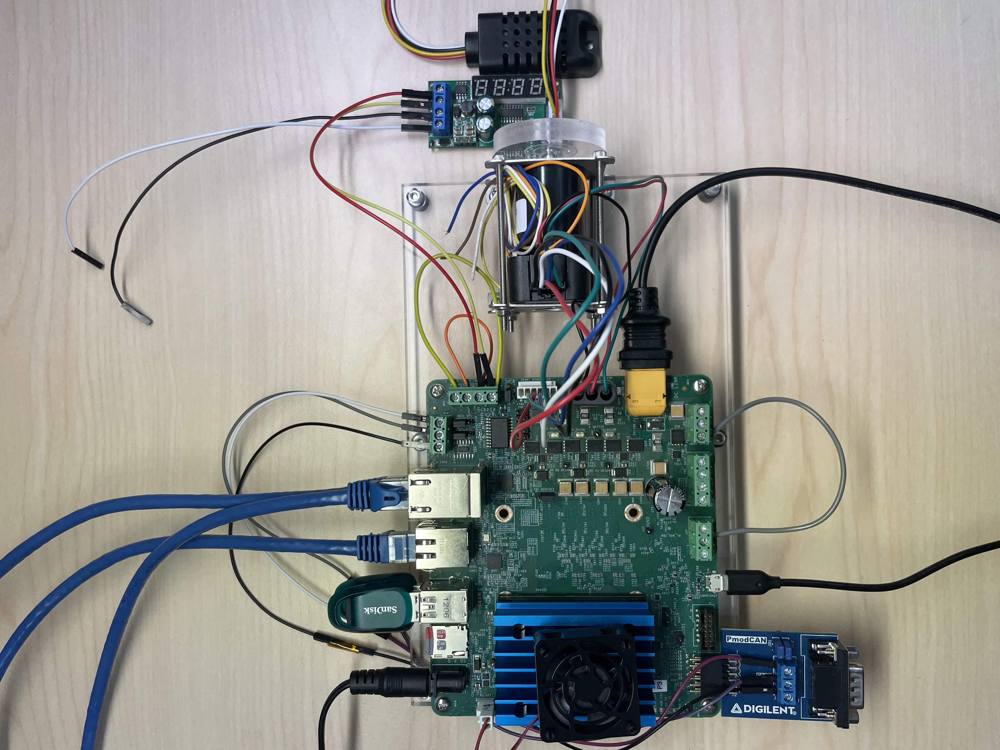
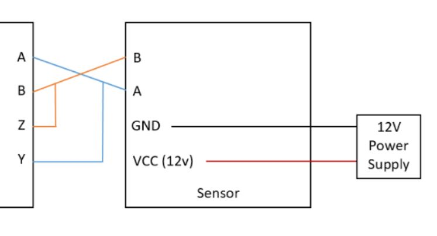
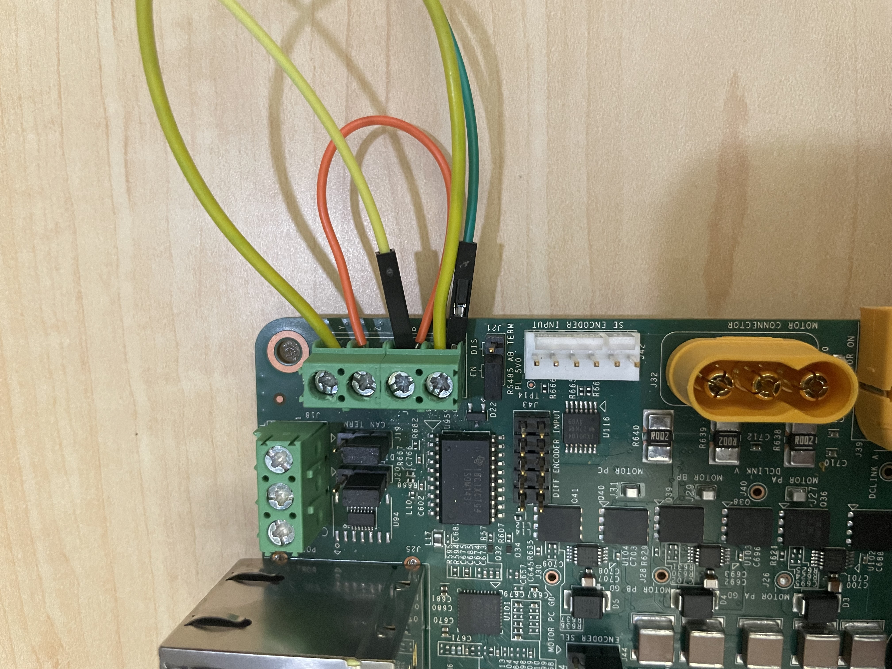
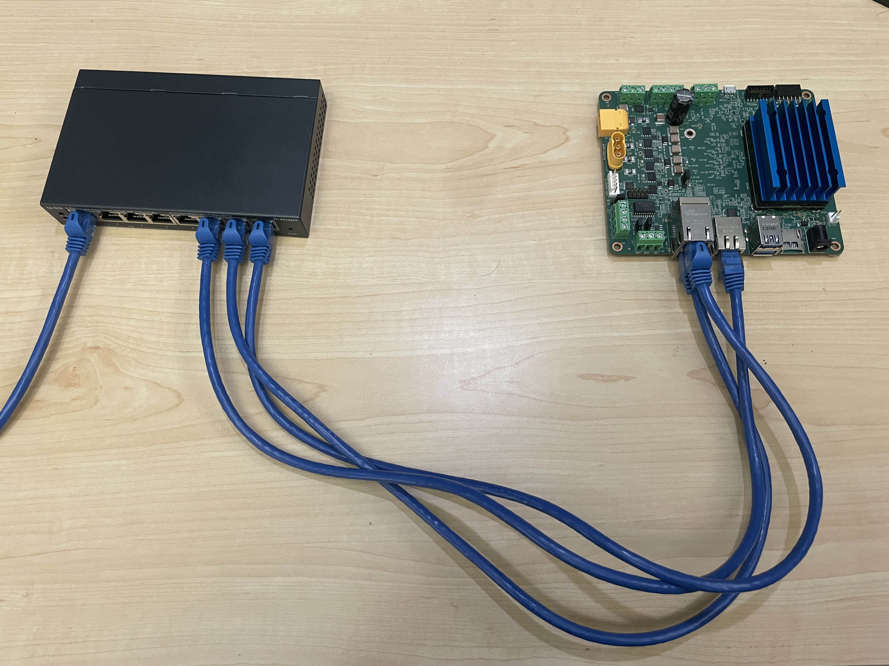
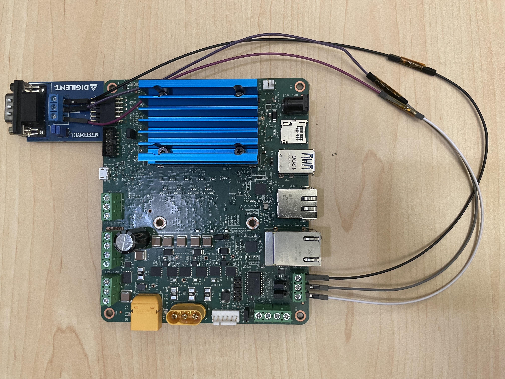
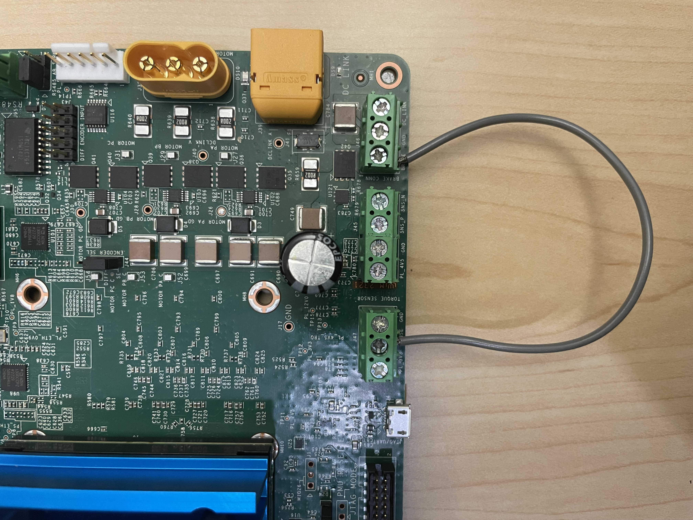

# KD240 BIST Board Setup

## Hardware Requirements

1. KD240 Starter Kit [here](http://www.amd.com/kd240)
2. KD240 Power Supply & Adapter
3. KD240 Motor Kit [here](http://www.amd.com/kd240)
4. 24V Power Supply for Motor Kit
5. MicroSD Card
6. Host Machine (Windows or Ubuntu)
7. 3 Ethernet Cables
8. Ethernet Switch
9. 1 [PMOD CAN](https://digilent.com/reference/pmod/pmodcan/start)
10. 10 Male to Male,Female to Female,Female to Male Jumper Wires
11. 1 RS485 Temperature and Humidity Sensor from [here](https://www.aliexpress.us/item/2251832868368800.html?gatewayAdapt=glo2usa4itemAdapt) or [here](https://www.amazon.com/Temperature-Humidity-Sensor-Display-Modbus/dp/B078NRYBVZ)
12. 2 USB Flash Drives

## Board Setup

This page shows how to set up the KD240 before running the BIST application.

Refer to KD240 Board & Interface layout below for connector reference numbers:

The image below shows a KD240 with all the hardware connected.

The BIST application requires the following hardware setup for running
the full suite of hardware tests:

* USB Flash Drive (x2)

  

  Connect a USB Flash Drive to each of the 2 USB ports.

* RS485 Temperature and Humidity Sensor (x1)

  

  Connect the RS485 Temperature and Humidity sensor as below on the J22 Connector 
  on the KD240. 
  User needs to obtain a separate 12V power supply to connect the two loose 
  jumpers in image below, one to GND(black wire in image) and one to 12V Supply
  (white wire in image)

  
  

  **NOTE**: Please make sure the J21 jumper is on 1-2(RS485-AB) combination

* Ethernet Cable (x3)

  

  Connect an Ethernet cable from each of the 3 Ethernet ports on the KD240 to
  the host machine via a switch.

* PMOD CAN (x1)

  

  Connect the PMOD-CAN test point headers to the J2 connector on the KD240. 
  Connect the PMOD-CAN(J2) to CAN 2.0(J18) using jumper wires as below
  - Connect GND on J2 to GND on J18
  - Connect CANH on J2 to CANH on J18
  - Connect CANL on J2 to CANL on J18

* Brake and 1-wire
  
  

  Connect Pin1(Brake) on J46 to the pin2(Sense) on J47 in loopback

* Motor Kit (x1)
  
  

  * Connect 24V power supply to J39
  * Connect encoder header pins to J42
  * Connect Motor's AC power jack to J32

## Next Steps

* [Run the BIST Application](run.md)

Copyright © 2023 Advanced Micro Devices, Inc

<a href="https://www.amd.com/en/corporate/copyright">Terms and Conditions</a>

